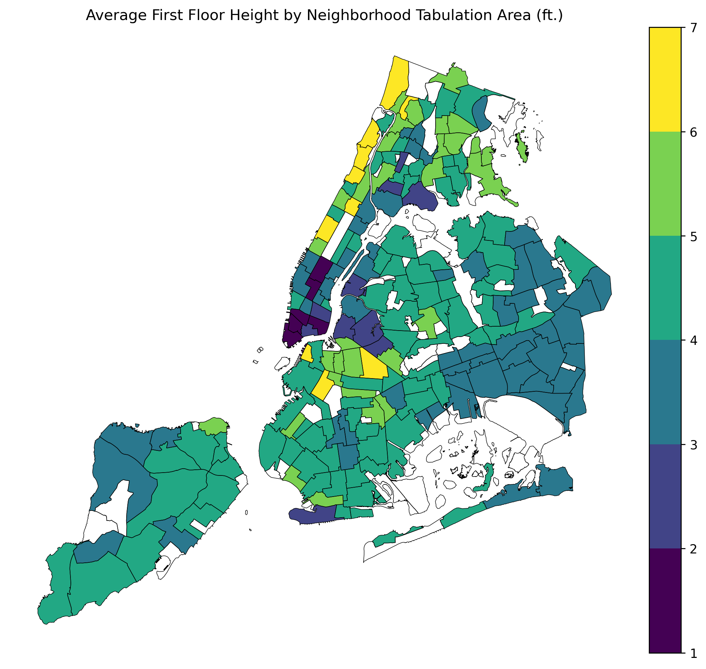
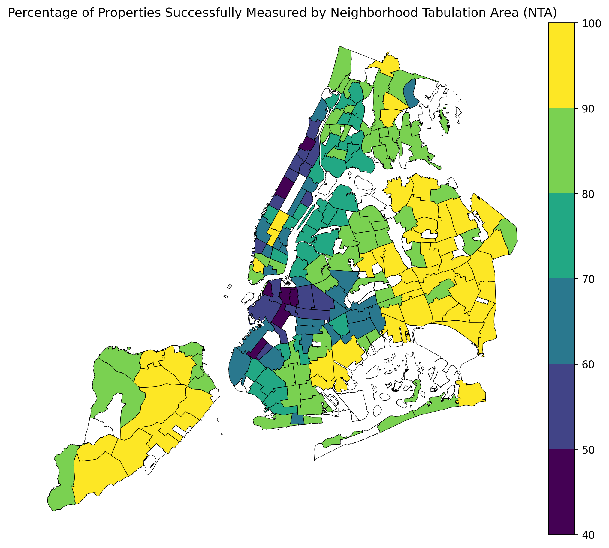

# A Five Step Approach to Evaluate NYC’s Building Elevation and Subgrade Dataset in Python
Mark Bauer

# Table of Contents
* [1. Introduction](#1-Introduction)
* [2. Notebooks](#2-Notebooks)
* [3. Data](#3-Data)
* [4. Additional Resources](#4-Additional-Resources)
* [5. Say Hello!](#5-Say-Hello)

Figure xx: Percent of properties that were successfully measured by Neighborhood Tabulation Area (NTA). White areas indicate parks, cemeteries, or other neighborhoods with less than 300 buildings and have been excluded from this display. This statistic was derived from the notes_1 attribute and indicates if there were any obstacles to obtaining the z_grade or z_floor measurement.

| notes1                                                                                                                               |   count |
|:-------------------------------------------------------------------------------------------------------------------------------------|--------:|
| Property not Visible Due to Construction or Obstruction                                                                              |  115281 |
| Property not Visible Due to Construction or Obstruction; No Address Plate or Identification on Building                              |   17132 |
| Property not Visible from Street; No Address Plate or Identification on Building                                                     |   12080 |
| Vacant Lot; No Address Plate or Identification on Building                                                                           |    1957 |
| Property not Visible Due to Construction or Obstruction; No Address Plate or Identification on Building; Property Under Construction |    1676 |
| Property not Visible Due to Construction or Obstruction; Property Under Construction                                                 |    1414 |
| Property not Visible from Street; No Address Plate or Identification on Building; Property Under Construction                        |       1 |
| Property not Visible from Street                                                                                                     |       1 |

Table xx: Count of buildings per notes1 attribute that were not successfully measured.

# 1. Introduction
On September 20, 2023, the NYC Department of City Planning (DCP) unveiled the Building Elevation and Subgrade (BES) dataset, lauded as a groundbreaking resource for understanding NYC building elevations and flood risk assessment. This dataset meticulously catalogues building floor elevations and subgrade spaces, pivotal for evaluating flood vulnerability and insurance implications under programs such as the National Flood Insurance Program (NFIP).

Inspired by the dataset's potential, this project aims to conduct a comprehensive evaluation of the NYC Building Elevation and Subgrade Dataset. Prior to formulating conclusions or strategies for its utilization, it is crucial to gain a nuanced understanding of its intricacies, limitations, and uncertainties.

I argue for a five step approach to evaluating and learning more about NYC’s Building Elevation and Subgrade Dataset. These steps include:
1. Preview Metadata: Examine the shape, counts, columns, data types and null constraints
2. Data Coverage: Calculate percentage null of whole dataset, as well as by different groups (e.g. neighborhood)
3. Summary Statistics and Visualize: Calculate statistics like min, max, mean, median of key features
4. Groundtruth: Compare values against another best available dataset
5. Feature Importance and Generalization: Identify features that contribute most to the model and to learn more about a target feature

For more information, please see the [data dictionary](https://github.com/mebauer/building-elevation-subgrade-nyc/blob/main/Building_Elevation_and_Subgrade-Data_Dictionary.xlsx) and the [data guidance](https://github.com/mebauer/building-elevation-subgrade-nyc/blob/main/Building%20Elevation%20and%20Subgrade%20Dataset%20Guidance.pdf) files.

# 2. Notebooks
- [1-metadata.ipynb](https://github.com/mebauer/building-elevation-subgrade-nyc/blob/main/1-metadata.ipynb)
- [2-data-coverage.ipynb](https://github.com/mebauer/building-elevation-subgrade-nyc/blob/main/2-data-coverage.ipynb)
- [3-summary-statistics.ipynb](https://github.com/mebauer/building-elevation-subgrade-nyc/blob/main/3-summary-statistics.ipynb)
- [4-nfip-comparison.ipynb](https://github.com/mebauer/building-elevation-subgrade-nyc/blob/main/4-nfip-comparison.ipynb)
- [5-feature-selection.ipynb](https://github.com/mebauer/building-elevation-subgrade-nyc/blob/main/5-feature-selection.ipynb)

# 3. Data
- Official press release: https://www.nyc.gov/site/planning/about/press-releases/pr-20230920.page
- Data on NYC Open Data: https://data.cityofnewyork.us/City-Government/Building-Elevation-and-Subgrade-BES-/bsin-59hv  
- Data on NYC Department of City Planning's website under Waterfront, Climate, & Sustainability Datasets:  
https://www.nyc.gov/site/planning/data-maps/open-data.page

# 4. Additional Resources

# 5. Say Hello!
Feel free to reach out for further discussions.
- LinkedIn: [markebauer](https://www.linkedin.com/in/markebauer/)  
- GitHub: [mebauer](https://github.com/mebauer)  
- Portfolio: [mebauer.github.io](https://mebauer.github.io/)

Keywords: *Building Elevation and Subgrade, Flood Risk, Flood, Flooding, Resiliency, First Floor, First Floor Elevation, First Floor Height, Lowest Adjacent Grade, Subgrade, Basement, New York City, Department of City Planning, Department of Building's, Python, pandas, GeoPandas, Numpy, Matplotlib, Seaborn, Jupyter, Open Data, Open Source, NYC Open Data*.